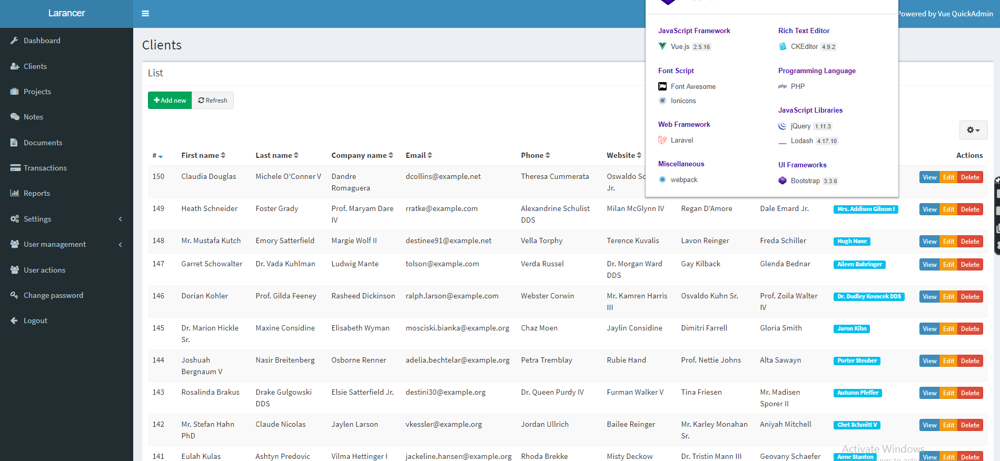

  

## How to use

- Clone the repository with __git clone__
- Copy __.env.example__ file to __.env__ and edit database credentials there
- Run __composer install__
- Run __php artisan key:generate__
- Run __php artisan migrate --seed__ (it has some seeded data for your testing)
- Run __php artisan passport:install__ (for API authentication)
- Run __npm install__
- Run __npm run dev__
- That's it: launch the main URL and login with default credentials __admin@admin.com__ - __password__
